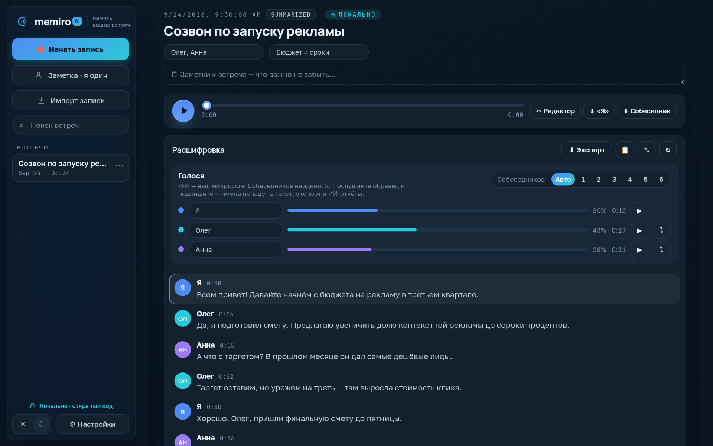
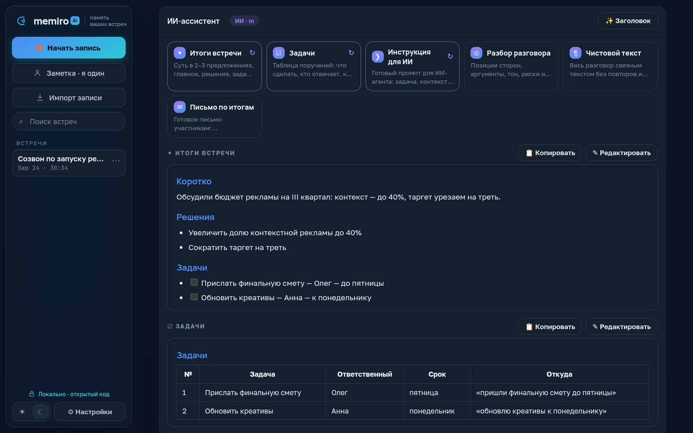
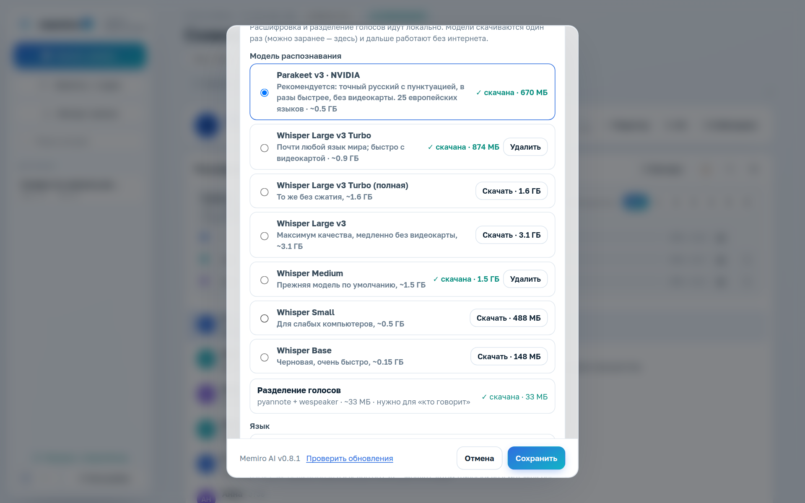
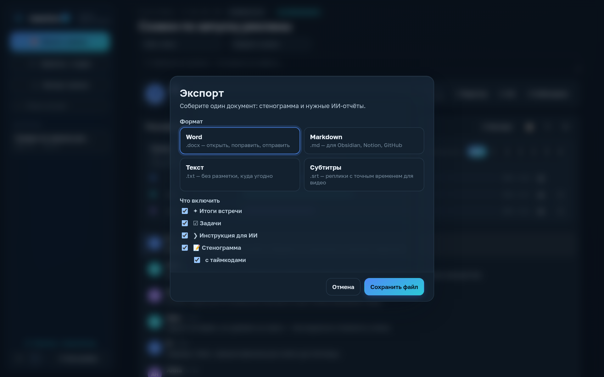
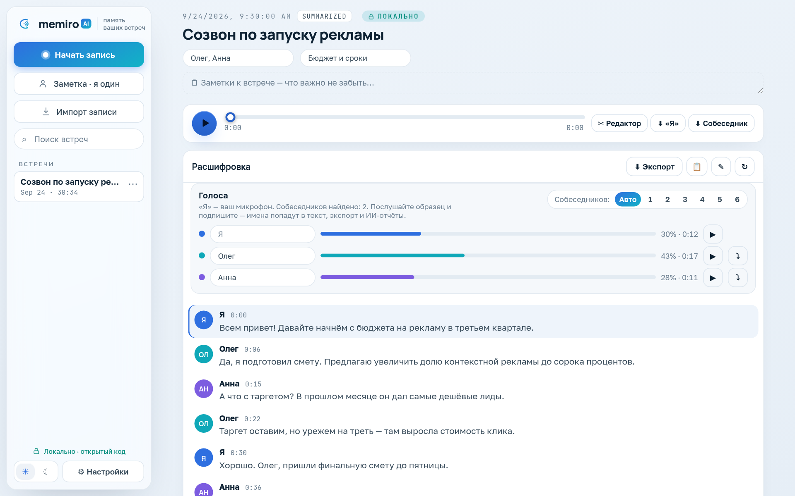

<p align="center">
  
</p>

<h1 align="center">Memiro AI — память ваших встреч</h1>

<p align="center">
  <strong>Приватный стенографист встреч для Windows и macOS: всё локально.</strong><br />
  Записывает любой созвон, расшифровывает на вашем компьютере, разделяет голоса и превращает разговор в итоги, задачи и инструкции для ИИ.
</p>

<p align="center">
  <a href="https://github.com/bglglzd/auris/releases/latest"></a>
  <a href="https://github.com/bglglzd/auris/actions/workflows/ci.yml"></a>
  
  <a href="LICENSE"></a>
</p>

<p align="center">
  <a href="https://github.com/bglglzd/auris/releases/latest"><b>Скачать</b></a> ·
  <a href="README.md">English</a> ·
  <a href="CHANGELOG.md">Что нового</a> ·
  <a href="CONTRIBUTING.md">Участие</a>
</p>

<p align="center">
  
</p>

## Зачем Memiro AI

Большинство сервисов для встреч отправляют ваши разговоры в чужое облако. Memiro хранит всё у вас: запись, распознавание речи и разделение голосов работают локально. ИИ-функции — по желанию и через **ваш** ключ и OpenAI-совместимый адрес.

- **Приватно по умолчанию** — аудио, расшифровки и отчёты не покидают компьютер.
- **Родной на Windows и Mac** — в том числе Mac на Intel и Apple Silicon; на macOS Memiro выглядит как приложение Apple: полупрозрачная боковая панель, шрифт SF, строка меню, сочетания с ⌘.
- **Любое приложение** — Zoom, Teams, Telegram, Discord, Google Meet, вкладка браузера: что слышно — то и записывается.
- **Точный русский и 25 европейских языков** — NVIDIA Parakeet v3 на обычном процессоре; для остальных языков — Whisper.
- **Понимает, кто говорит** — автоматическое определение числа собеседников, в том числе в групповых звонках.
- **От разговора к делу** — итоги, таблица задач, разбор, чистовой текст, письмо по итогам и готовый промпт для ИИ-агента.

## Возможности

| | |
|---|---|
| ⏺ **Запись** | Кнопка, значок в трее / строке меню или глобальная клавиша `Ctrl+Shift+R` (на Mac — `⌘⇧R`). Две дорожки — ваш микрофон («Я») и системный звук (собеседники). Пауза, восстановление после сбоя, авто-запись при начале звонка в мессенджере (Windows). |
| 📝 **Расшифровка** | Полностью офлайн. По умолчанию — **NVIDIA Parakeet TDT 0.6B v3**: пунктуация и регистр, ~10× быстрее реального времени на CPU, без «галлюцинаций» на тишине. **Whisper** (large-v3-turbo и др.; видеокарта через Vulkan на Windows и Metal на Apple Silicon) — для остальных языков. Модели скачиваются один раз. |
| 🗣 **Голоса** | Разделение говорящих (pyannote segmentation-3.0 + WeSpeaker ResNet34 на ONNX Runtime), число голосов — автоматически. Панель «Голоса»: доля речи, ▶ образец голоса, имена, «Объединить», смена числа голосов мгновенно — без повторной расшифровки. |
| ✦ **ИИ-ассистент** *(по желанию, ваш ключ)* | Заголовок сам после расшифровки и шесть пресетов: **Итоги встречи**, **Задачи** (кто · что · когда), **Разбор разговора**, **Чистовой текст**, **Письмо по итогам**, **Инструкция для ИИ** — структурированный промпт для Claude, Cursor, ChatGPT и других агентов. Вопросы по встрече. Длинные разговоры — по частям. |
| ⬇ **Экспорт** | Одно окно: **Word (.docx)**, Markdown, текст или **субтитры SRT** — стенограмма (с таймкодами или без) и любые ИИ-отчёты в одном документе. |
| ✂ **Аудио-редактор** | Волна громкости по дорожкам, вырезание лишнего, предпрослушивание; все дорожки и расшифровка сдвигаются синхронно; «Вернуть оригинал» в один клик. |
| 🔄 **Обновления** | Подписанные обновления: Memiro сам находит новую версию, показывает «что нового» и ставит её с перезапуском только после вашего согласия. |

<p align="center">
  
  
</p>
<p align="center">
  
  
</p>

## Как начать

1. Скачайте Memiro из [последнего релиза](https://github.com/bglglzd/auris/releases/latest):
   - **Windows** — `Memiro.AI_x.y.z_x64-setup.exe`, запустите установщик.
   - **Mac на Apple Silicon** (M1 и новее) — `Memiro.AI_x.y.z_aarch64.dmg`; **Mac на Intel** — `Memiro.AI_x.y.z_x64.dmg`. Перетащите Memiro AI в «Программы». См. [первый запуск на macOS](#первый-запуск-на-macos).
2. Во время звонка нажмите **Начать запись** (или `Ctrl+Shift+R` / `⌘⇧R`) — либо **Импорт записи** для готового файла (m4a, mp3, wav, ogg/opus, flac…).
3. Откройте встречу и нажмите **Расшифровать**. В первый раз Memiro один раз скачает модель речи (~0,5 ГБ) и модели голосов (~33 МБ). Можно заранее: **Настройки → Распознавание**.
4. *(По желанию)* В **Настройки → Искусственный интеллект** укажите базовый адрес, ключ и модель любого OpenAI-совместимого сервиса: OpenAI, OpenRouter, локальный Ollama / LM Studio / llama.cpp. Тогда Memiro сам даст встрече заголовок и подведёт итоги.

> Соблюдайте законы о записи разговоров, действующие для вас и всех участников звонка.

### Первый запуск на macOS

Версия для Mac пока не заверена Apple (нотаризация), поэтому в первый раз macOS скажет, что не может проверить разработчика:

1. Откройте «Программы», **правый клик по Memiro AI → Открыть**, затем ещё раз **Открыть**. (Или: *Системные настройки → Конфиденциальность и безопасность* → **Всё равно открыть**.) Нужно один раз.
2. **Микрофон** — macOS спросит при первой записи, разрешите.
3. **Голоса собеседников** — системный звук записывается через ScreenCaptureKit, для этого нужно *Системные настройки → Конфиденциальность и безопасность → Запись экрана и системного звука* → включить **Memiro AI** и перезапустить приложение. В Memiro статус и кнопка перехода — в **Настройки → Запись**. Записывается только звук, не экран; звуки самого Memiro не попадают в запись. Без разрешения Memiro всё равно пишет микрофон и предупреждает об этом.

Обновления ставятся так же, как на Windows.

### Системные требования

- **Windows** 10 или 11, x64.
- **macOS** 13 Ventura и новее, Apple Silicon или Intel.
- Рекомендуется 8 ГБ ОЗУ; ~1,5 ГБ на диске под модели.
- Видеокарта не обязательна (Whisper может использовать Vulkan на Windows и Metal на Apple Silicon); Parakeet быстро работает на процессоре.

## Приватность

| Остаётся на компьютере | Уходит в сеть |
|---|---|
| Аудио, расшифровки, данные о голосах, ИИ-отчёты, настройки и ваш API-ключ | Только при использовании ИИ: текст расшифровки этой встречи — на **указанный вами адрес** |
| Распознавание речи и разделение голосов — офлайн после разовой загрузки моделей | Загрузка моделей (GitHub / Hugging Face) и проверка обновлений (GitHub Releases) |

Телеметрии и аккаунтов нет. Данные лежат в папке приложения (`%APPDATA%` на Windows, `~/Library/Application Support` на macOS); удаление встречи удаляет её файлы.

## Как это устроено

```
микрофон ────┐                          ┌─ Parakeet v3 / Whisper ─┐
             ├─ захват (2 дорожки) ─────┤                         ├─ расшифровка ─┬─ Голоса
системный звук┘                         └─ pyannote + WeSpeaker ──┘               ├─ ИИ-пресеты (ваш ключ)
                                                                                  └─ Экспорт (docx/md/txt/srt)
```

- **Запись** — две дорожки 16 кГц моно. Windows: микрофон (event-режим WASAPI) и системный звук (loopback, опрос). macOS: микрофон через CoreAudio, системный звук через ScreenCaptureKit (без звуков самого Memiro).
- **Распознавание** — дорожки нормализуются тем же декодером, что и импорт, режутся в паузах и расшифровываются Parakeet (ONNX Runtime) или whisper.cpp.
- **Голоса** — речь размечается окнами по 10 с, для каждого локального говорящего считается «отпечаток» голоса; агломеративная кластеризация с отсевом мелких кластеров находит число людей. Отпечатки кешируются — число голосов меняется мгновенно.
- **ИИ** — у каждого пресета свой промпт; в запрос идут имена голосов, модель не выдумывает факты; длинные встречи — map-reduce.

## Сборка из исходников

Нужны [Rust](https://rustup.rs) (stable), [Node.js](https://nodejs.org) 20+ и CMake, а также:

- **Windows** — LLVM (libclang), для GPU-сборки — Vulkan SDK.
- **macOS 13+** — Xcode Command Line Tools. ONNX Runtime грузится из dylib в комплекте приложения: один раз скачайте её `scripts/fetch-onnxruntime-macos.sh` (1.23.2 — последняя версия и для Intel, и для Apple Silicon).

```bash
npm ci
# Windows
npm run tauri dev -- --features whisper,diarize,opus,parakeet     # запуск
npm run tauri build -- --features gpu,diarize,opus,parakeet       # установщик (как в релизе)
# macOS (Apple Silicon — metal; Intel — whisper)
scripts/fetch-onnxruntime-macos.sh
npm run tauri dev -- --features metal,diarize,opus,parakeet
npm run tauri build -- --features metal,diarize,opus,parakeet     # .app + .dmg
```

На macOS собирайте только через Tauri CLI (`npm run tauri …`): он включает private-API-фичу для полупрозрачного окна.

| Cargo-фича | Что добавляет |
|---|---|
| `parakeet` | Распознавание NVIDIA Parakeet (ONNX Runtime) |
| `whisper` / `gpu` / `metal` | Встроенный whisper.cpp; `gpu` — ускорение Vulkan (Windows), `metal` — Metal (Apple Silicon) |
| `diarize` | Разделение голосов (ONNX Runtime) |
| `opus` | Импорт Ogg/Opus (голосовые сообщения) |

### Тесты

Доменная логика — в крейте `uxo-core` без GUI, тестируется на любой ОС.

```bash
cargo test -p uxo-core                  # ядро: хранилище, аудио, кластеризация, ИИ, экспорт…
npm test && npx tsc --noEmit            # фронтенд (vitest) и типы
npm run build                           # сборка фронтенда
# сквозные тесты на настоящих моделях (скачивают их):
cargo test -p uxo-core --features diarize --test diarize_e2e -- --ignored
cargo test --release -p uxo-core --features parakeet --test parakeet_e2e -- --ignored
```

CI на каждый PR прогоняет тесты фронтенда и ядра, полную Windows-сборку приложения, сборки macOS для Apple Silicon и Intel (со сквозным тестом голосов) и сквозные тесты распознавания на Windows.

### Структура

```
core/        uxo-core — запись, хранилище, декодирование, распознавание, голоса, ИИ (без GUI)
src-tauri/   слой Tauri 2: команды, трей, горячая клавиша, строка меню macOS, монитор авто-записи
src/         интерфейс на React 19 + TypeScript (дизайн-система Memiro в App.css)
docs/        порядок релиза, статус, скриншоты
```

## Релизы

Каждый релиз подписывается и публикуется в [GitHub Releases](https://github.com/bglglzd/auris/releases) вместе с `latest.json` для обновления из приложения. Что изменилось — в [CHANGELOG.md](CHANGELOG.md), как выпускать — в [docs/RELEASE.md](docs/RELEASE.md).

## Участие и безопасность

Задачи и pull request'ы приветствуются — см. [CONTRIBUTING.md](CONTRIBUTING.md) и [правила сообщества](.github/CODE_OF_CONDUCT.md). Об уязвимостях сообщайте приватно, как описано в [SECURITY.md](SECURITY.md).

## Лицензия

[MIT](LICENSE) © участники Memiro AI. Модели речи и голосов скачиваются у авторов и распространяются по своим лицензиям (NVIDIA Parakeet — CC-BY-4.0, OpenAI Whisper — MIT, pyannote segmentation-3.0 — MIT, WeSpeaker ResNet34 — CC-BY-4.0).
